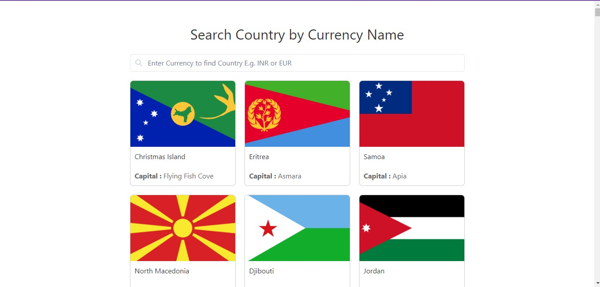
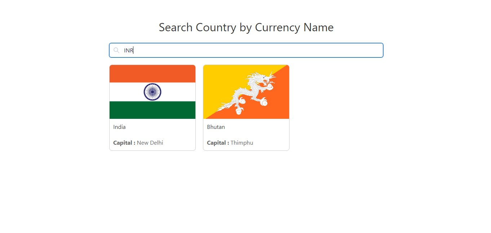

# metta_social
# Currency-Country Finder App Documentation

## Table of Contents

- [How to Start the App](#how-to-start-the-app)
- [Screenshots](#screenshots)
  - [Default Value](#default-value)
  - [Search Value](#search-value)
- [App Functionality](#app-functionality)
  - [Search Filter](#search-filter)
  - [Responsiveness](#responsiveness)
- [Tech Stack](#tech-stack)
- [Deployed Link](#deployed-link)

## How to Start the App

To run the app locally, follow these steps:

1. Clone the repository:

   ```bash
   git clone https://github.com/GaneshYadav3142/metta_social.git

2. Move to myapp: 
   
   ```bash
   cd myapp

3. Install Necessary Dependencies: 

    ```bash
   npm install

4. Start the app the app will run on port 3000:

    ```bash
    npm start
    
   
## Screenshots

### Default Value



### Search Value




## App Functionality

1. These app is Fully Responsive to all Screens available:

2. You can Search the country name by entering it currency value/name:


## Tech Stack

The app is built using the following technologies:

1. React :
2. Chakra UI for component styling:
3. CSS3 for responsive styling:


## Deployed Link


